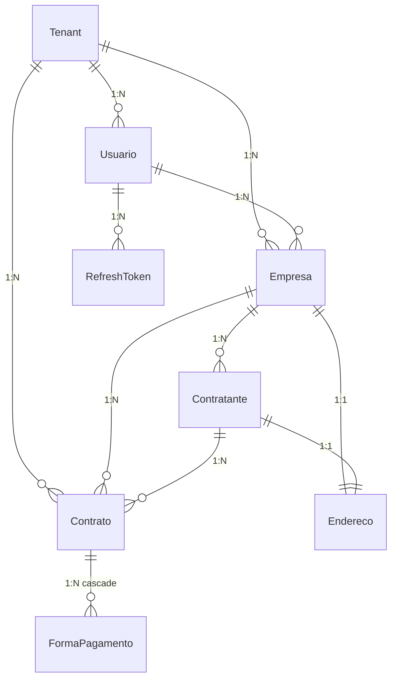
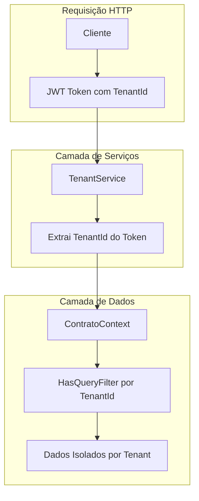
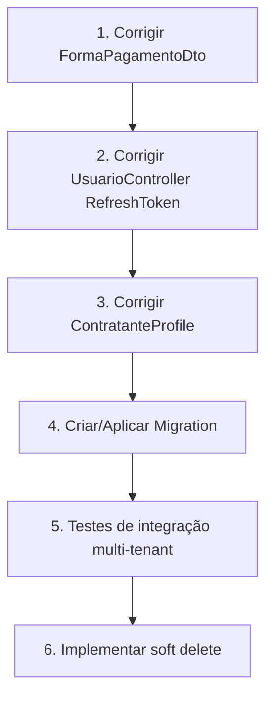

# Contexto do Projeto — Contratos API

> **Última atualização:** Janeiro 2025 (Atualizado: Implementação Multi-Tenancy)  
> Este documento serve como base única (source of truth) para qualquer mudança no projeto.

---

## 📋 Resumo Geral

| Item | Descrição |
|------|-----------|
| **Objetivo** | API REST para gerenciamento de contratos entre empresas e contratantes, com suporte a multi-tenant |
| **Framework** | .NET 8 |
| **Linguagem** | C# 12 |
| **ORM** | Entity Framework Core 8.0.23 |
| **Banco de Dados** | SQL Server |
| **Autenticação** | JWT Bearer Token com Refresh Token |
| **Mapeamento** | AutoMapper 12.0 |

---

## 📁 Estrutura do Projeto

```
Contratos_API/
├── Controllers/           # Endpoints da API
│   ├── ContratoController.cs
│   ├── ContratanteController.cs
│   ├── EmpresaController.cs
│   ├── EnderecoController.cs
│   ├── FormaPagamentoController.cs
│   ├── TenantController.cs
│   └── UsuarioController.cs
├── Data/
│   └── ContratoContext.cs # DbContext com Fluent API
├── Dto/                   # Data Transfer Objects
│   ├── ContratoDto.cs
│   ├── ContratanteDto.cs
│   ├── EmpresaDto.cs
│   ├── EnderecoDto.cs
│   ├── FormaPagamentoDto.cs
│   ├── LoginDto.cs
│   ├── TenantDto.cs
│   ├── TokenResponseDto.cs
│   ├── UsuarioDto.cs
│   └── UsuarioResponseDto.cs
├── Interface/
│   ├── IJwtService.cs        # Interface do serviço JWT
│   ├── ITenantEntity.cs      # Interface para entidades multi-tenant
│   └── ITenantServices.cs    # Interface do serviço de tenant
├── Model/                    # Entidades do domínio
│   ├── Contratante.cs
│   ├── Contrato.cs
│   ├── Empresa.cs
│   ├── Endereco.cs
│   ├── FormaPagamento.cs
│   ├── RefreshToken.cs
│   ├── Tenant.cs
│   └── Usuario.cs
├── Profiles/              # AutoMapper Profiles
│   └── UsuarioProfile.cs
├── Services/
│   ├── JwtServices.cs        # Implementação JWT
│   └── TenantService.cs      # Implementação do serviço de tenant
├── Program.cs
├── appsettings.json
└── Contratos.csproj
```

---

## 🗃️ Entidades e Relacionamentos

### Diagrama de Entidades (Mermaid)



### Detalhamento das Entidades

#### **Tenant** (Multi-tenancy)
```csharp
public class Tenant
{
    public Guid TenantId { get; set; }        // PK
    public string Nome { get; set; }
    public DateTime DataCriacao { get; set; }
    public string Email { get; set; }
    public string Ddd { get; set; }
    public string Telefone { get; set; }
    public string UrlLogo { get; set; }
}
```

#### **Usuario**
```csharp
public class Usuario : ITenantEntity
{
    public Guid UsuarioId { get; set; }       // PK
    public Guid TenantId { get; set; }        // FK → Tenant
    public string NomeUsuario { get; set; }
    public string Senha { get; set; }         // Hash BCrypt
    public string Email { get; set; }
    public string Telefone { get; set; }
    public Tenant Tenant { get; set; }
    public ICollection<RefreshToken> RefreshTokens { get; set; }
}
```

#### **RefreshToken**
```csharp
public class RefreshToken : ITenantEntity
{
    public Guid Id { get; set; }              // PK
    public Guid UsuarioId { get; set; }       // FK → Usuario
    public Guid TenantId { get; set; }        // FK → Tenant ✅ NOVO
    public string Token { get; set; }
    public DateTime Expiration { get; set; }  // ✅ Corrigido typo
    public bool IsRevoked { get; set; }
    public DateTime CreatedAt { get; set; }   // ✅ Corrigido typo
    public Usuario? Usuario { get; set; }
}
```

#### **Empresa**
```csharp
public class Empresa : ITenantEntity
{
    public Guid EmpresaId { get; set; }       // PK
    public Guid EnderecoId { get; set; }      // FK → Endereco (1:1)
    public Guid UsuarioId { get; set; }       // FK → Usuario
    public Guid TenantId { get; set; }        // FK → Tenant
    public string RazaoSocial { get; set; }
    public string CNPJ { get; set; }
    public string NomeFantasia { get; set; }
    public string IE { get; set; }
    public string IM { get; set; }
    public string NaturezaJuridica { get; set; }
    public DateTime DataAbertura { get; set; }
    // Navegações
    public Endereco Endereco { get; set; }
    public Usuario Usuario { get; set; }
    public Tenant Tenant { get; set; }
}
```

#### **Endereco**
```csharp
public class Endereco
{
    public Guid EnderecoId { get; set; }      // PK
    public string CEP { get; set; }
    public string Logradouro { get; set; }
    public string Numero { get; set; }
    public string Bairro { get; set; }
    public string Cidade { get; set; }
    public string Estado { get; set; }
    public string Pais { get; set; }
    public string Complemento { get; set; }
}
```

#### **Contratante**
```csharp
public class Contratante : ITenantEntity
{
    public Guid ContratanteId { get; set; }   // PK
    public Guid EmpresaId { get; set; }       // FK → Empresa
    public Guid EnderecoId { get; set; }      // FK → Endereco (1:1)
    public Guid TenantId { get; set; }        // FK → Tenant ✅ NOVO
    public string RazaoSocial { get; set; }
    public string NomeFantasia { get; set; }
    public string Documento { get; set; }
    // Navegações
    public Empresa Empresa { get; set; }
    public Endereco Endereco { get; set; }
    public Tenant Tenant { get; set; }        // ✅ NOVO
}
```

#### **Contrato**
```csharp
public class Contrato : ITenantEntity
{
    public Guid ContratoId { get; set; }      // PK
    public Guid EmpresaId { get; set; }       // FK → Empresa
    public Guid TenantId { get; set; }        // FK → Tenant
    public Guid ContratanteId { get; set; }   // FK → Contratante
    public string? Titulo { get; set; }
    public string? Objeto { get; set; }
    public DateTime DataInicio { get; set; }
    public DateTime DataFim { get; set; }
    public double Valor { get; set; }
    // Navegações
    public Empresa Empresa { get; set; }
    public Tenant Tenant { get; set; }
    public Contratante Contratante { get; set; }
    public ICollection<FormaPagamento>? FormasPagamento { get; set; }
}
```

#### **FormaPagamento**
```csharp
public class FormaPagamento : ITenantEntity
{
    public Guid FormaPagamentoId { get; set; } // PK
    public Guid ContratoId { get; set; }       // FK → Contrato
    public Guid TenantId { get; set; }         // FK → Tenant ✅ NOVO
    public string Descricao { get; set; }
    public int NumeroParcela { get; set; }
    public bool Ativo { get; set; }
    public DateTime DataCriacao { get; set; }
    public DateTime DataAlteracao { get; set; }
    public Contrato? Contrato { get; set; }
}
```

---

## 🔐 Autenticação JWT

### Configuração (`appsettings.json`)
```json
{
  "Jwt": {
    "key": "ThisIsASecretKeyForJwtTokenGeneration",
    "issuer": "ContratosAPI",
    "audience": "ContratosAPIUsers",
    "ExpirationMinutes": 60
  }
}
```

### Interface `IJwtService`
```csharp
public interface IJwtService
{
    (string Token, DateTime Expiration) GenerateToken(Usuario usuario);
    (string Acesstoken, DateTime AcessTokenExpiration) GenerateAccessToken(Usuario usuario);
    (string RefreshToken, DateTime RefreshTokenExpiration) GenerateRefreshToken();
    ClaimsPrincipal? GetPrincipalFromExpiredToken(string token);
}
```

### Tokens
| Tipo | Duração | Uso |
|------|---------|-----|
| **Access Token** | 15 minutos | Requisições autenticadas |
| **Refresh Token** | 7 dias | Renovar Access Token |

---

## 🏢 Multi-Tenancy (IMPLEMENTADO)

### Conceito
Multi-tenancy permite que uma única instância da aplicação sirva múltiplos clientes (tenants), mantendo seus dados completamente isolados.

### Arquitetura Implementada



### Interface `ITenantEntity`
```csharp
namespace Contratos.Interface;

public interface ITenantEntity
{
    Guid TenantId { get; set; }
}
```

### Interface `ITenantServices`
```csharp
namespace Contratos.Interface;

public interface ITenantServices
{
    Guid GetCurrentTenantId();
    bool HasTenant();
}
```

### Serviço `TenantService`
```csharp
public class TenantService : ITenantServices
{
    private readonly IHttpContextAccessor _httpContextAccessor;

    public TenantService(IHttpContextAccessor httpContextAccessor)
    {
        _httpContextAccessor = httpContextAccessor;
    }

    public Guid GetCurrentTenantId()
    {
        var tenantIdClaim = _httpContextAccessor.HttpContext?.User
            .FindFirst("TenantId")?.Value;

        if (string.IsNullOrEmpty(tenantIdClaim) || !Guid.TryParse(tenantIdClaim, out var tenantId))
            throw new InvalidOperationException("TenantId não encontrado no token.");

        return tenantId;
    }

    public bool HasTenant()
    {
        var tenantIdClaim = _httpContextAccessor.HttpContext?.User
            .FindFirst("TenantId")?.Value;
        return !string.IsNullOrEmpty(tenantIdClaim);
    }
}
```

### Entidades com Multi-Tenancy

| Entidade | Implementa `ITenantEntity` | `HasQueryFilter` |
|----------|---------------------------|------------------|
| `Usuario` | ✅ | ✅ |
| `Empresa` | ✅ | ✅ |
| `Contrato` | ✅ | ✅ |
| `Contratante` | ✅ | ✅ |
| `FormaPagamento` | ✅ | ✅ |
| `RefreshToken` | ✅ | ✅ |

### Query Filters no DbContext
```csharp
// Exemplo de filtro global aplicado
modelBuilder.Entity<Usuario>()
    .HasQueryFilter(u => _tenantServices == null ||
                         !_tenantServices.HasTenant() ||
                         u.TenantId == _tenantServices.GetCurrentTenantId());
```

### Claim `TenantId` no JWT
O `TenantId` é incluído como claim em ambos os métodos de geração de token:
- `GenerateToken()` — Login inicial
- `GenerateAccessToken()` — Refresh token

```csharp
var claims = new[]
{
    new Claim(ClaimTypes.NameIdentifier, usuario.UsuarioId.ToString()),
    new Claim(ClaimTypes.Name, usuario.NomeUsuario),
    new Claim(ClaimTypes.Email, usuario.Email ?? ""),
    new Claim("TenantId", usuario.TenantId.ToString())  // ✅ Claim de Tenant
};
```

### Registro no `Program.cs`
```csharp
builder.Services.AddHttpContextAccessor();
builder.Services.AddScoped<ITenantServices, TenantService>();
```

---

## 🎮 Controllers e Endpoints

| Controller | Rota Base | Autenticação | Operações |
|------------|-----------|--------------|-----------|
| `UsuarioController` | `/api/usuario` | ✅ (exceto login/registrar) | CRUD + Login + Refresh Token |
| `EmpresaController` | `/api/empresa` | ✅ | CRUD + PATCH |
| `ContratoController` | `/api/contrato` | ✅ | CRUD |
| `ContratanteController` | `/api/contratante` | ✅ | CRUD |
| `TenantController` | `/api/tenant` | ✅ | CRUD |
| `EnderecoController` | `/api/endereco` | ✅ | CRUD |
| `FormaPagamentoController` | `/api/formapagamento` | ✅ | CRUD |

### Endpoints de Autenticação
```
POST /api/usuario/registrar     [AllowAnonymous] → Cadastro de usuário
POST /api/usuario/login         [AllowAnonymous] → Login e geração de tokens
POST /api/usuario/refresh-token [AllowAnonymous] → Renovação de token (pendente)
```

---

## 📦 Pacotes NuGet

```xml
<PackageReference Include="AutoMapper" Version="12.0.0" />
<PackageReference Include="AutoMapper.Extensions.Microsoft.DependencyInjection" Version="12.0.0" />
<PackageReference Include="Microsoft.AspNetCore.Authentication.JwtBearer" Version="8.0.23" />
<PackageReference Include="Microsoft.AspNetCore.JsonPatch" Version="8.0.23" />
<PackageReference Include="Microsoft.AspNetCore.Mvc.NewtonsoftJson" Version="8.0.23" />
<PackageReference Include="Microsoft.EntityFrameworkCore" Version="8.0.23" />
<PackageReference Include="Microsoft.EntityFrameworkCore.Design" Version="8.0.23" />
<PackageReference Include="Microsoft.EntityFrameworkCore.SqlServer" Version="8.0.23" />
<PackageReference Include="Swashbuckle.AspNetCore" Version="8.1.4" />
```

---

## ⚠️ Problemas Identificados e Pendências

### ✅ Resolvidos (Implementação Multi-Tenancy)

| # | Problema | Status |
|---|----------|--------|
| 1 | Interface `ITenantEntity` criada | ✅ Resolvido |
| 2 | Interface `ITenantServices` criada | ✅ Resolvido |
| 3 | Serviço `TenantService` implementado | ✅ Resolvido |
| 4 | Entidades implementam `ITenantEntity` | ✅ Resolvido |
| 5 | `HasQueryFilter` em todas entidades multi-tenant | ✅ Resolvido |
| 6 | Claim `TenantId` no `GenerateToken` | ✅ Resolvido |
| 7 | Claim `TenantId` no `GenerateAccessToken` | ✅ Resolvido |
| 8 | `TenantController` CRUD | ✅ Resolvido |
| 9 | `TenantId` em `Contratante` | ✅ Resolvido |
| 10 | `TenantId` em `FormaPagamento` | ✅ Resolvido |
| 11 | `TenantId` em `RefreshToken` | ✅ Resolvido |
| 12 | Relacionamento `Contratante → Tenant` | ✅ Resolvido |
| 13 | Typos corrigidos em `RefreshToken` | ✅ Resolvido |

### 🟡 Pendentes (Melhorias Recomendadas)

| # | Problema | Arquivo | Solução |
|---|----------|---------|---------|
| 1 | **DTO `FormaPagamentoDto`** - `ContratoId` é `int`, deveria ser `Guid` | `Dto/FormaPagamentoDto.cs` | Corrigir tipo |
| 2 | **DTO `FormaPagamentoDto`** - Falta `TenantId` | `Dto/FormaPagamentoDto.cs` | Adicionar propriedade |
| 3 | **DTO `FormaPagamentoDto`** - Mensagens de erro genéricas | `Dto/FormaPagamentoDto.cs` | Corrigir mensagens |
| 4 | **UsuarioController** - Falta `TenantId` ao criar `RefreshToken` | `Controllers/UsuarioController.cs` | Adicionar `TenantId = usuario.TenantId` |
| 5 | **UsuarioController** - Refresh endpoint deve usar `IgnoreQueryFilters()` | `Controllers/UsuarioController.cs` | Adicionar `.IgnoreQueryFilters()` na busca |
| 6 | **ContratanteProfile** - Mapeamento incorreto | `Profiles/ContratanteProfile.cs` | Usar `Ignore()` para navegações |

---

## ✅ Próximos Passos Recomendados



### Comandos para Migration
```powershell
dotnet ef migrations add MultiTenancyImplementation
dotnet ef database update
```


## 📚 Referências

- [Entity Framework Core Relationships](https://aka.ms/efcore-relationships)
- [EF Core Global Query Filters](https://learn.microsoft.com/ef/core/querying/filters)
- [Multi-tenancy in EF Core](https://learn.microsoft.com/ef/core/miscellaneous/multitenancy)
- [JWT Bearer Authentication](https://docs.microsoft.com/aspnet/core/security/authentication/jwt)
- [AutoMapper Documentation](https://automapper.org/)

---

## 📝 Changelog

### Janeiro 2025 - Implementação Multi-Tenancy

**Novos Arquivos:**
- `Interface/ITenantEntity.cs` — Interface para entidades multi-tenant
- `Interface/ITenantServices.cs` — Interface do serviço de tenant
- `Services/TenantService.cs` — Implementação do serviço de tenant

**Arquivos Modificados:**
- `Model/Usuario.cs` — Implementa `ITenantEntity`
- `Model/Empresa.cs` — Implementa `ITenantEntity`
- `Model/Contrato.cs` — Implementa `ITenantEntity`
- `Model/Contratante.cs` — Implementa `ITenantEntity` + `TenantId` + `Tenant`
- `Model/FormaPagamento.cs` — Implementa `ITenantEntity` + `TenantId`
- `Model/RefreshToken.cs` — Implementa `ITenantEntity` + `TenantId` + correção typos
- `Data/ContratoContext.cs` — `HasQueryFilter` para todas entidades multi-tenant
- `Services/JwtServices.cs` — Claim `TenantId` em `GenerateAccessToken`
- `Program.cs` — Registro de `ITenantServices` e `IHttpContextAccessor`
- `Dto/ContratanteDto.cs` — Adicionado `TenantId`

---

> **Nota:** Este documento deve ser atualizado sempre que houver mudanças significativas na arquitetura ou modelos do projeto.